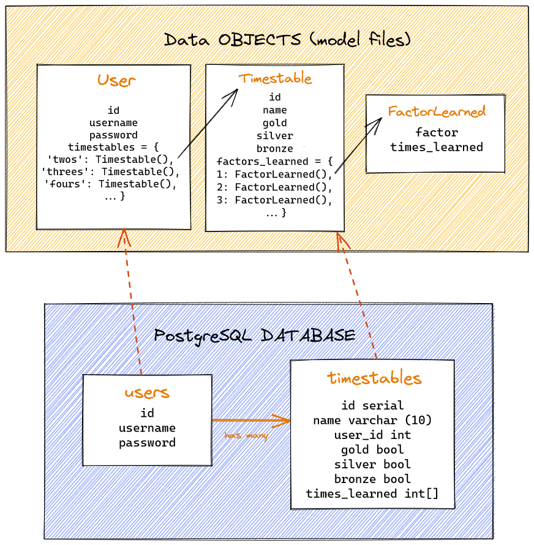

# Times Table Coach

This is a web app that teaches children their multiplication tables.
I developed this app myself in late 2021 and have been revisiting it after finishing my Makers Academy Coding bootcamp.
I am currently working on a record time system to see the highscores for each timestable by different players.

### Tech Used

- Python - backend
- Flask - running the server
- PostgreSQL - database hosted on bit.io
- JavaScript - interactivity on test and practice screens
- HTML - web layout
- CSS - style

Times Table Coach is live available under:  
[https://ttcoach.herokuapp.com](ttcoach.herokuapp.com)

Here is a video where I am introducing the app:   

### Development

12/05/2023 - Rewrote functions to display timer, using requestAnimationFrame instead of setInterval, allowing more precision. Now the time records and displays correctly up to 1/100 of a second.

08/05/2023 - Added playwright and wrote a few tests checking login is working correctly

06/05/2023 - Added pytest and wrote lots of unit tests for functions in app.py

19/02/2023 - Lots of refactoring in app.py, abstracting checks for username and password into separate functions.

09/01/2023 - I have spent the last couple of weeks setting up a PostgreSQL database and linked it with the project. Now all the user data, information about medals and which timestables have been learned are saved securely via bit.io.  

Here is an overview on how the data is saved in the SQL database and how it is accessed by the app.  

