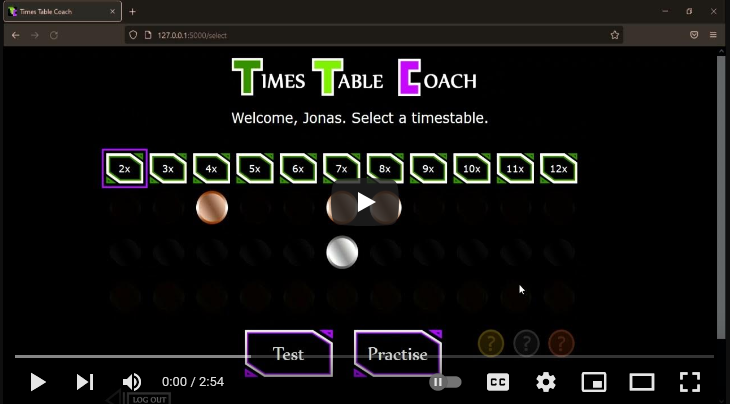

# Times Table Coach

This is a web app that teaches children their multiplication tables.

It live available under:
[https://ttcoach.herokuapp.com](ttcoach.herokuapp.com)

Here is a video where I am introducing the app:   

### Development

09/01/2023 - I have spent the last couple of weeks setting up a PostgreSQL database and linked it with the project. Now all the user data, information about medals and which timestables have been learned are saved securely via bit.io.  

Here is an overview on how the data is saved in the SQL database and how it is accessed by the app.

